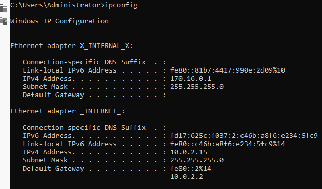
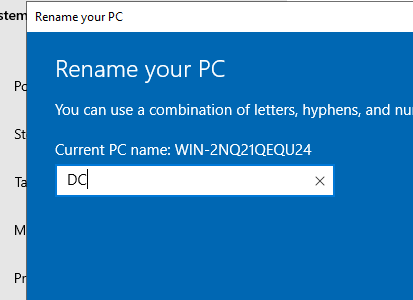
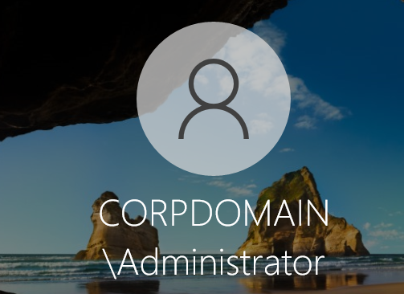
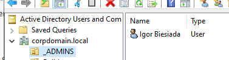
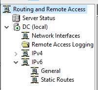
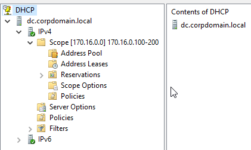
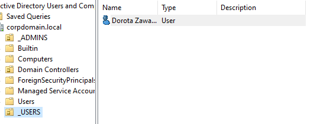

# Windows Server GUI Infrastructure Lab

## 📌 Project Overview
This repository documents the deployment and configuration of a corporate IT infrastructure using **Windows Server 2022 (Desktop Experience)**.

While my previous project focused on **Server Core and PowerShell automation**, this lab is designed to demonstrate proficiency with standard **Microsoft Management Tools** (GUI). The goal is to simulate a traditional administrative workflow using **Server Manager**, **Microsoft Management Console (MMC)**, and graphical configuration wizards.

This project serves as a complementary study to the *Windows Server Core Automation Lab*, showcasing a comprehensive understanding of both CLI-based and GUI-based Windows Server administration.

## 🎯 Key Objectives
* **OS Deployment:** Installation and initial configuration of Windows Server with **Desktop Experience**.
* **Role Management:** Deploying Active Directory Domain Services (AD DS) and DNS using **Server Manager**.
* **Domain Promotion:** Promoting the server to a Domain Controller (DC) and establishing the forest root.
* **User & Group Management:** Managing organizational units (OUs) and administrative accounts via **Active Directory Users and Computers (ADUC)**.

## 🛠 Technologies & Tools
* **Hypervisor:** Oracle VirtualBox
* **Operating System:** Windows Server 2022 Standard (Desktop Experience)
* **Management Tools:** Server Manager, ADUC, DNS Manager, MMC.
* **Network:** Internal Isolated Network.

---

## 🚀 Implementation Steps

### Phase 1: Server Preparation
The initial setup focused on standardizing the server identity and network settings before role deployment.

**1. Network Interface Configuration**
* Renamed the network adapter to **"LAN"** for clarity.
* Assigned a **Static IPv4 address** to ensure a stable foundation for DNS and AD DS.

**2. Hostname Configuration**
* Renamed the server to `SRV-DC01` to follow corporate naming conventions.
* Performed a system restart to apply the new NetBIOS name.

### Phase 2: AD DS Installation & Domain Promotion
This phase involved installing the Active Directory binaries and promoting the server to a Domain Controller to establish the `corpdomain.local` forest.

* **Deployment:** Installed the **Active Directory Domain Services** role via Server Manager and initiated the promotion wizard.
* **Configuration:** Selected **"Add a new forest"** with the root domain name `corpdomain.local`.
* **Verification:** The successful deployment is confirmed by the domain-integrated login screen, showing the transition to the **CORPDOMAIN** security authority.

### Phase 3: Administrative Hierarchy & Privilege Management
To maintain a secure and organized environment, a dedicated administrative structure was implemented, moving away from the default built-in administrator account.

* **Organizational Unit (OU) Design:** Created a top-level OU named `_ADMINS` to store highly privileged accounts, ensuring they are easily identifiable and manageable for Group Policy application.
* **Account Provisioning:** Created a personalized administrative user within the `_ADMINS` directory.
* **Privilege Escalation:** Assigned the user to the **Domain Admins** security group, granting the necessary permissions to manage the entire forest.

### Phase 4: Network Routing & Connectivity (RAS/NAT)
To provide internet access to the isolated internal network without exposing it directly to the external environment, the server was configured as a NAT gateway.

* **Role Installation:** Added the **Remote Access** role via Server Manager, specifically enabling the **Routing** role service.
* **Routing and Remote Access (RRAS):** Configured the RRAS console to enable **Network Address Translation (NAT)**.
* **Interface Mapping:** Identified the external-facing adapter (WAN) to act as the gateway and the internal adapter (LAN) to receive translated traffic.
* **Functionality:** This setup allows internal domain clients to reach external resources (updates, web) while maintaining a secure, private network boundary.

### Phase 5: Dynamic Host Configuration Protocol (DHCP) Implementation
To automate network addressing for domain clients, the DHCP role was deployed and integrated with Active Directory.

* **Role Deployment:** Installed the **DHCP Server** role and completed the post-installation configuration by **authorizing** the server in AD DS.
* **Scope Configuration:** Created a new IPv4 Scope (e.g., `CORP_Internal`) with a defined range of distributable IP addresses.
* **Scope Options:** Configured critical network parameters for clients:
    * **003 Router:** Set to the LAN IP of the DC (providing NAT gateway access).
    * **006 DNS Servers:** Set to the DC's IP to ensure domain name resolution.
* **Activation:** Activated the scope to begin leasing addresses to workstations in the isolated network.

### Phase 6: Corporate User Hierarchy
After securing administrative accounts, a standard organizational structure was established for regular corporate employees.

* **Standard Users OU:** Created a dedicated Organizational Unit named `_USERS`. This separation allows for different Group Policy Objects (GPOs) to be applied to regular employees versus administrators.
* **Test User Provisioning:** Created a sample corporate user account (e.g., `Dorota Zawartka`) to simulate a real-world employee onboarding process.
* **Identity Standardization:** Configured standard login formats and basic user attributes to verify directory consistency.

